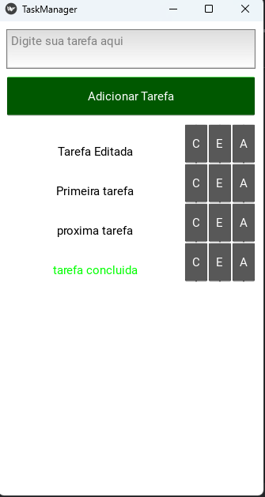

## Visão Geral
O **Gerenciador de Tarefas** é um aplicativo simples e intuitivo para ajudar você a organizar suas atividades diárias. Desenvolvido com **Kivy** em Python, ele oferece uma interface limpa, sendo compatível tanto para **celulares** quanto para **computadores**.

### Captura de Tela do Projeto:

---

## Tecnologias Utilizadas
Este projeto foi desenvolvido utilizando as seguintes tecnologias:

- **Python**: A linguagem de programação principal.
- **Kivy**: Framework usado para desenvolver a interface gráfica.
- **PyCharm**: IDE utilizada para o desenvolvimento do código.
- **GitHub Pages**: Utilizado para hospedar a documentação do projeto.

---

## Compatibilidade com Dispositivos
O **Gerenciador de Tarefas** foi projetado para ser **compatível com celulares e computadores**, proporcionando uma experiência de uso fluida em ambos os dispositivos. Ele adapta a interface automaticamente para as diferentes resoluções de tela:

- **Celulares**: Interface ajustada para telas menores e toque.
- **Computadores**: Layout otimizado para telas maiores, com maior controle de navegação.

---

## Benefícios e Vantagens
- **Produtividade Melhorada**: Organize suas tarefas de forma eficiente e aumente sua produtividade.
- **Fácil Integração**: O código é modular e fácil de estender.
- **Código Aberto**: O projeto é open-source, permitindo contribuições e personalizações.

---

## Como Contribuir
Este projeto está aberto para colaboração! Para contribuir:

1. Faça um **fork** do repositório.
2. Crie um branch para suas modificações (`git checkout -b feature/nova-funcionalidade`).
3. Envie suas alterações (`git push origin feature/nova-funcionalidade`).
4. Crie um **pull request** para revisar suas mudanças.

[Confira o código no GitHub](https://github.com/LeonardoSilvaPy/Gerenciador-de-Tarefas).

---

## Contato
Se você tiver dúvidas ou sugestões, entre em contato:

- **Email**: [leonardosilva9737@gmail.com](mailto:leonardosilva9737@gmail.com)
- **GitHub**: [LeonardoSilvaPy](https://github.com/LeonardoSilvaPy)

