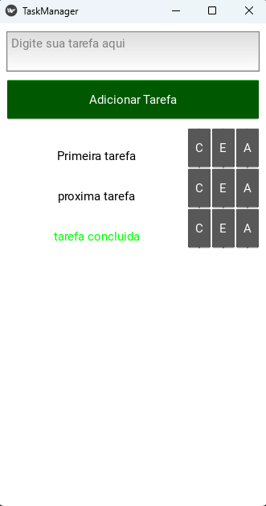
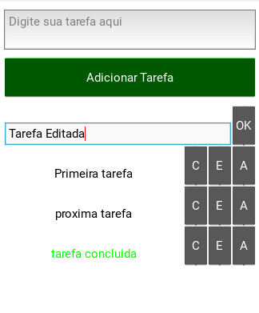

# Gerenciador de Tarefas

Bem-vindo ao **Gerenciador de Tarefas**, uma solução eficiente para organizar suas atividades diárias de forma simples e prática.

## Visão Geral
O Gerenciador de Tarefas foi desenvolvido com o framework **Kivy** em Python, oferecendo uma interface amigável e intuitiva. Este aplicativo permite que os usuários acompanhem, adicionem e marquem tarefas como concluídas, organizando-as de maneira clara e acessível.

### Captura de Tela do Projeto:

## Compatibilidade com Dispositivos
O **Gerenciador de Tarefas** foi projetado para ser **compatível tanto com celulares quanto com computadores**, oferecendo uma experiência de uso fluida em diferentes plataformas. Com a interface responsiva, você pode usar o aplicativo em:

- **Celulares**: A interface é adaptada para telas menores, garantindo uma experiência de uso eficiente em dispositivos móveis.
- **Computadores**: No desktop, o aplicativo oferece uma tela maior para uma visualização mais ampla e um gerenciamento mais fácil das tarefas.

Seja em um **smartphone** ou em um **computador**, o aplicativo mantém sua funcionalidade intuitiva e acessível.

## Tecnologias Utilizadas
- **Python**: Linguagem de programação principal.
- **Kivy**: Framework utilizado para a construção da interface gráfica.
- **GitHub Pages**: Para hospedar a documentação do projeto.

## Benefícios e Vantagens
- **Produtividade Melhorada**: Com um sistema organizado de gerenciamento, os usuários podem visualizar rapidamente suas pendências e manter o foco no que importa.
- **Fácil Integração**: O código é modular, facilitando a adição de novas funcionalidades.
- **Código Aberto**: O projeto é open-source e está disponível para que desenvolvedores possam contribuir e personalizar conforme suas necessidades.

## Como Contribuir
Este projeto está aberto para colaboração! Se você tem interesse em contribuir, siga os passos abaixo:
1. Faça um **fork** do repositório.
2. Crie um branch para suas modificações (`git checkout -b feature/nova-funcionalidade`).
3. Envie suas alterações (`git push origin feature/nova-funcionalidade`).
4. Crie um **pull request** para revisar suas mudanças.

[Confira o código no GitHub](https://github.com/LeonardoSilvaPy/Gerenciador-de-Tarefas).

---

## Contato
Se você tiver alguma dúvida ou sugestão sobre o Gerenciador de Tarefas, fique à vontade para entrar em contato:
- **Email**: [leonardosilva9737@gmail.com](mailto:leonardosilva9737@gmail.com)
- **GitHub**: [LeonardoSilvaPy](https://github.com/LeonardoSilvaPy)
